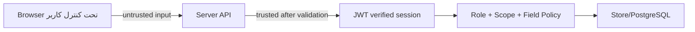

# Authentication Flow — Wave -1 / Architecture Discovery Part 1

**تاریخ:** ۱۸/۰۶/۱۴۰۵ — 2026-09-09  
**محدوده:** مستندسازی جریان احراز هویت فعلی؛ بدون تغییر کد.  
**شاخه کاری Arena:** `arena/01a085da-p2`

---

## 1. اصل محصول

پایش در مدل فعلی **رمز عبور کاربری ندارد**. ورود محصول بر پایه این سه جزء است:

```text
شماره موبایل + کد پیامکی OTP + کد ملی
```

ستون/فیلدهای قدیمی password در داده‌های دمو، منبع احراز هویت نیستند و نباید دوباره به مسیر ورود برگردند مگر با تصمیم معماری جدید.

---

## 2. Flow سطح بالا

```mermaid
sequenceDiagram
  participant UI as Browser Login UI
  participant Send as POST /api/auth/send-code
  participant OTP as OTP store / Redis-ready state
  participant Login as POST /api/auth/login
  participant JWT as JWT HS256
  participant Cookie as HttpOnly Cookie
  participant Me as GET /api/auth/me

  UI->>Send: { phone }
  Send->>Send: validate phone + unknown-field reject
  Send->>OTP: cooldown + phone/IP/daily rate-limit
  Send->>OTP: generate 6 digit CSPRNG OTP, store hash only
  Send-->>UI: { ok:true, code:'sent' } بدون enumeration
  UI->>Login: { phone, code, national_id }
  Login->>OTP: validate code hash + expiry + tries
  Login->>Login: match national_id to user of phone
  Login->>Login: active user + active school
  Login->>JWT: sign {sub,role,school_id,iat,exp,jti,sv,iss,aud}
  JWT->>Cookie: Set-Cookie payesh_session; HttpOnly; SameSite=Lax
  Login-->>UI: user projection + masked phone
  UI->>Me: cookie
  Me-->>UI: current session user
```

---

## 3. Endpointها

| Endpoint | فایل | نقش |
|---|---|---|
| `POST /api/auth/send-code` | `server/auth.js` | validate phone، rate-limit، تولید OTP و ذخیره hash |
| `POST /api/auth/login` | `server/auth.js` | بررسی OTP، کد ملی، active بودن و ساخت session |
| `GET /api/auth/me` | `server/auth.js` | خواندن session از cookie و projection کاربر |
| `POST /api/auth/logout` | `server/auth.js` | revoke کردن `jti` و پاک کردن cookie |
| `POST /api/auth/delete-account` | `server/auth.js`, `server/gdpr.js` | مسیر حذف حساب/حق فراموشی |

---

## 4. OTP و Rate Limit

### وضعیت فعلی

- OTP با `crypto.randomInt(100000, 1000000)` ساخته می‌شود.
- مقدار خام کد نباید روی disk/audit ذخیره شود؛ hash کد ذخیره می‌شود.
- TTL کد فعلی: ۵ دقیقه.
- محدودیت‌ها شامل cooldown، سقف روزانه، سقف IP و سقف phone هستند.
- `PAYESH_DEMO_CODE=1` فقط برای دمو/تست می‌تواند کد را در پاسخ echo کند.

### ریسک‌ها و الزام ملی

| مورد | وضعیت فعلی | هدف ملی |
|---|---|---|
| OTP state | `otp-store.js` و Redis-ready behavior | Redis با TTL، بدون fallback محلی در production |
| rate limit | `server/rate-limit.js` + Redis/cache | توزیع‌شده و atomic برای چند instance |
| timing oracle | پاسخ send-code برای شماره ناشناس هم‌شکل است | حفظ و تست مداوم |
| brute force | tries و IP login limit | افزایش coverage با تست abuse در Wave 13/17 |

---

## 5. JWT و Session

JWT در `server/auth.js` به‌صورت HS256 hard-coded امضا/اعتبارسنجی می‌شود. فیلدهای مهم:

```text
iss = payesh
aud = payesh-web
sub = user.id
role = user.role
school_id = user.school_id یا null
iat
exp
jti
sv = session version
```

قواعد:

- `alg` از header به‌عنوان تصمیم امنیتی پذیرفته نمی‌شود؛ HS256 hard-coded است.
- `iss` و `aud` باید دقیقاً match باشند.
- `iat` نباید آینده یا قدیمی‌تر از TTL نشست باشد.
- `jti` با denylist/revocation کنترل می‌شود.
- session version برای revoke-all قابل استفاده است.
- cookie باید `HttpOnly` باشد و زیر HTTPS باید `Secure` شود.
- `SameSite=Lax` انتخاب شده تا لینک‌های ورود/پیامک بی‌دلیل کاربر را از session نیندازند.

---

## 6. Client Auth Detection

در کلاینت، `src/js/00-data-layer.js` هنگام سرو شدن از سرور، `/api/health` را probe می‌کند. اگر سرور زنده باشد:

```text
DATA_MODE = server
SYNC.demoMode = false
/api/auth/me بررسی می‌شود
```

اگر برنامه با `file://` یا بدون سرور باز شود:

```text
DATA_MODE = local
دمو/آفلاین امن باقی می‌ماند
هیچ درخواست خارجی اجباری نیست
```

---

## 7. Trust Boundaries



اصول:

- نقش از body یا client state پذیرفته نمی‌شود.
- `op.by` در sync فقط ادعاست و باید با `jwt.sub` بخواند.
- `school_id` برای نقش‌های scoped باید از session/سرور derive یا verify شود.
- response نباید phone/national_id کامل را افشا کند مگر policy صریح داشته باشد.

---

## 8. Auth Risks برای Waveهای بعدی

| ریسک | شدت | توضیح | Wave هدف |
|---|---|---|---|
| Redis نبودن critical state در production | Critical | OTP/rate/revocation باید بین instanceها مشترک باشد. | Wave 6 |
| drift بین REST و Sync authorization | Critical | احراز هویت مشترک است ولی policy endpointها باید واحد شود. | Wave 5 |
| session invalidation در چند instance | High | revocation باید Redis-backed و تست‌شده بماند. | Wave 6/13 |
| enum/phone probing | High | پاسخ‌ها و timing باید برابر بمانند. | Wave 13/17 |
| secrets و JWT key rotation | High | کلید باید خارج repo و با rotation plan باشد. | Wave 13/15 |

---

## 9. Evidence

- `server/auth.js`: `apiSendCode`, `apiLogin`, `apiMe`, `apiLogout`, JWT sign/verify.
- `server/otp-store.js`: نگهداشت OTP state.
- `server/rate-limit.js`: rate-limit توزیع‌شونده.
- `server/revocation.js`: denylist/session version.
- `src/js/00-data-layer.js`: detectServer و `Api.request`.
- تست‌های موجود: `tests/server3.js`, `tests/otp-ratelimit.js`, `tests/otp-redis.js`, `tests/secret-scan.js`.
