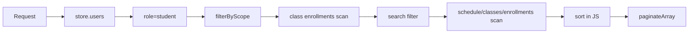

# Bottleneck Map — Wave -1 / Architecture Discovery Part 2

**تاریخ:** ۱۸/۰۶/۱۴۰۵ — 2026-09-09  
**محدوده:** شناسایی گلوگاه‌های معماری فعلی بر اساس Dependency/Data/Auth/Sync Flow؛ بدون تغییر کد.  
**شاخه کاری Arena:** `arena/01a085da-p2`

---

## 1. خلاصه اجرایی

بزرگ‌ترین گلوگاه‌های پایش برای مقیاس ملی مربوط به CPU خام نیستند؛ مربوط به **شکل جریان داده** هستند:

1. readهای مبتنی بر scan/filter/sort در حافظه به جای SQL native.
2. JSON/memory store transitional در کنار PostgreSQL.
3. sync/pull غیر DB-native و conflict/idempotency در مسیر سنگین.
4. synchronous file I/O و whole-store serialization.
5. cache/Redis/readiness که باید با benchmark و production policy سخت شود.
6. نبود capacity model و load/soak/chaos واقعی.

---

## 2. Heat Map گلوگاه‌ها

| ID | گلوگاه | شدت | احتمال در مقیاس ملی | اثر | Wave هدف | Evidence |
|---|---|---|---|---|---|---|
| B01 | Full scan/filter/sort در REST reads | Critical | High | p95/p99 بالا، CPU زیاد، heap growth | Wave 3 | `server/routes/students.js`, `attendance.js`, `grades.js`, `users.js` |
| B02 | Pull delta با scan store | Critical | High | sync کند، payload بزرگ، timeout | Wave 4 | `server/pull.js` |
| B03 | JSON/memory store به‌عنوان source transitional | Critical | High | divergence بین instanceها، write loss risk | Wave 1 | `server/index.js`, `server/db.js` |
| B04 | persistence و serialization فایل JSON | High | Medium/High | event-loop blocking، latency spike | Wave 1/9 | `persistStore`, `JSON.stringify(store)` |
| B05 | sync batch processing با policy سنگین | High | Medium/High | CPU spike، latency بالا، conflict backlog | Wave 4/5/7 | `server/sync.js` |
| B06 | authorization/scope تکراری REST و Sync | Critical | Medium | هم امنیت و هم performance را پیچیده می‌کند | Wave 5 | `server/sync.js`, `server/routes/*` |
| B07 | Redis critical state readiness | High | Medium | چند instance بدون state مشترک، duplicate/replay | Wave 6 | `server/redis.js`, `cache.js`, `rate-limit.js` |
| B08 | audit logging و rotation در process | Medium/High | Medium | I/O pressure، log loss در crash | Wave 9/14 | `server/audit.js` |
| B09 | backup/restore در application process | High | Medium | latency و disk pressure؛ خطر freeze | Wave 9/16 | `server/admin.js` |
| B10 | build تک‌فایلی بسیار بزرگ | Medium | Medium | initial load/memory در دستگاه ضعیف | Wave 9/11 | `index.html`, `USER_GUIDE.html` |
| B11 | client localStorage/IndexedDB growth | High | Medium/High | quota error، slow startup/replay | Wave 7 | `03-persistence.js`, compaction docs/tests |
| B12 | نبود SQL query plan benchmark | High | High | index اشتباه یا cache اشتباه | Wave 3/18 | `server/schema.sql`, `migrations/002_indexes.sql` |
| B13 | synchronous heavy reports/exports | Medium/High | Medium | request timeout و memory spike | Wave 8/9 | report/export paths در client/server docs |
| B14 | OpenTelemetry/metrics ناقص برای ظرفیت | High | High | مشکل دیده نمی‌شود تا دیر شود | Wave 14 | `server/tracing.js` و فقدان metrics کامل |
| B15 | test dataset غیر ملی | High | High | load test غیرواقعی و نتیجه گمراه‌کننده | Wave 18 | demo seed ≈ هزار کاربر، نه 10M |
| B16 | chaos/failure path تست‌نشده | Critical | High | recovery اثبات نشده | Wave 19 | Addendum/ROADMAP |

---

## 3. مسیرهای پرترافیک و گلوگاه‌هایشان

### 3.1 `GET /api/v1/students`



**گلوگاه:** pagination بعد از scan/filter/sort انجام می‌شود.  
**راهکار:** SQL-native query با `WHERE school_id`, role, class, search index، `ORDER BY`, keyset cursor.

### 3.2 `GET /api/v1/attendance`

```text
store.attendance → filterByScope → filter date/class/student → parent/student role filter → sort → paginate
```

**گلوگاه:** attendance در مقیاس ملی time-oriented و حجیم است.  
**راهکار:** index ترکیبی `(school_id, class_id, date, id)` و در آینده partitioning بر اساس workload.

### 3.3 `GET /api/v1/grades`

```text
store.grades → scope → filters → role restrictions → enrich subject/student با find در آرایه → sort → paginate
```

**گلوگاه:** enrich با lookupهای آرایه‌ای می‌تواند O(n*m) شود.  
**راهکار:** SQL JOIN کنترل‌شده یا lookup با index/CTE، projection امن، keyset pagination.

### 3.4 `POST /api/sync`

```text
batch → per-op validation → authz → fieldGate → inScope → idempotency → OCC → apply → mirror → audit/notifications
```

**گلوگاه:** هر op چندین جست‌وجوی store و policy دارد؛ در batchهای زیاد CPU بالا می‌رود.  
**راهکار:** DB-native push، prepared statements، transaction chunking، idempotency Redis/PostgreSQL، metrics برای per-stage latency.

### 3.5 `GET /api/v1/pull`

```text
scope collections → scan changes/tombstones/conflicts → response
```

**گلوگاه:** pull باید پرتکرارترین مسیر sync باشد؛ scan کامل برای ملی مناسب نیست.  
**راهکار:** `updated_at,id` cursor، tombstone table، scoped SQL، limit دقیق.

---

## 4. Resource Bottlenecks

| منبع | عامل فشار | نشانه | اقدام پیشنهادی |
|---|---|---|---|
| CPU | filter/sort/enrich در JS | event-loop lag، p95 بالا | Wave 3 SQL-native reads |
| Heap/RAM | load whole store، response بزرگ، guide/index بزرگ | GC زیاد، RSS رشد | bounded cache، streaming/pagination، payload projection |
| Disk I/O | JSON persistence، audit rotation، backup | latency spike، fs wait | DB source of truth، async logging، backup خارج request process |
| DB pool | queryهای کند یا transaction طولانی | pool wait، timeout | pool metrics، indexes، query plan، transaction کوتاه |
| Redis | rate/idempotency/cache hot keys | Redis latency/errors | key design، TTL، sharding/cluster در صورت benchmark |
| Network | payloadهای bootstrap/pull بزرگ | response size بالا | projection، compression، delta واقعی، CDN static |
| Browser storage | event log/cache رشدکننده | quota exceeded، startup کند | compaction، max bytes/age، DLQ |

---

## 5. Bottleneckهای امنیتی-عملکردی

برخی کنترل‌های امنیتی خودشان می‌توانند در مقیاس ملی bottleneck شوند اگر طراحی DB/Cache درست نباشد:

| کنترل | ریسک عملکرد | راهکار |
|---|---|---|
| tenant scope teacher/parent | join/lookup زیاد برای هر request | index روی assignment/enrollments/parent_links و policy query مشترک |
| enum guard / 404 counting | state per session زیاد | Redis TTL key و cardinality limit |
| audit برای هر mutation | write amplification | async centralized log/outbox |
| field-level authz | هزینه per-op در sync batch | precompiled policy و metrics per-stage |
| conflict preservation | رشد جدول conflict | status index، retention، dashboard و alert |

---

## 6. Bottleneck Map Mermaid

```mermaid
flowchart TD
  Browser[Browser Offline Queue] -->|batch push| Sync[/api/sync]
  Browser -->|delta pull| Pull[/api/v1/pull]
  UIReads[REST Reads] --> Routes[server/routes/*]

  Sync --> Policy[validation/authz/scope/OCC]
  Policy --> Store[(JSON/memory transitional store)]
  Routes --> Store
  Pull --> Store
  Store --> Serialization[JSON.stringify / disk persist]
  Store --> DBMirror[PostgreSQL mirror]
  Sync --> Audit[Audit/log]
  Sync --> Notifications[notifications/conflicts]
  Routes --> Enrich[JS enrich/find/sort]

  Serialization:::hot
  Store:::hot
  Enrich:::hot
  Pull:::hot
  Policy:::warm
  DBMirror:::warm

  classDef hot fill:#ffd6d6,stroke:#c00,color:#111;
  classDef warm fill:#fff0c2,stroke:#b7791f,color:#111;
```

---

## 7. اولویت رفع Bottleneckها

| اولویت | اقدام | دلیل |
|---:|---|---|
| 1 | Wave 1: PostgreSQL-only source of truth | بدون آن چند instance state واحد ندارند. |
| 2 | Wave 3: DB-native high-traffic reads | بزرگ‌ترین منبع CPU/heap و latency فعلی. |
| 3 | Wave 4: DB-native pull/push | sync در محصول offline-first مسیر حیاتی است. |
| 4 | Wave 5: policy layer واحد | هم امنیت و هم performance query planning را بهتر می‌کند. |
| 5 | Wave 6: Redis-only critical state | چند instance بدون Redis-ready خطرناک است. |
| 6 | Wave 14: metrics/logs/traces | بدون مشاهده، bottleneckها قابل اثبات نیستند. |
| 7 | Wave 18/19: load/soak/chaos | آمادگی ملی فقط با تست واقعی ثابت می‌شود. |

---

## 8. معیارهای اندازه‌گیری پیشنهادی

| مسیر | متریک لازم |
|---|---|
| REST reads | p50/p95/p99، rows scanned، rows returned، response bytes، DB latency |
| Sync push | ops/sec، per-op latency، conflict rate، reject rate، queue depth |
| Pull | records/sec، cursor lag، response bytes، tombstone count |
| Auth | OTP sends/min، login failures، rate-limit hits، latency equalization |
| DB | TPS، pool wait، slow query، lock wait، index hit ratio |
| Redis | ops/sec، hit/miss، latency، evictions، errors |
| Browser | startup time، local DB size، queue bytes، replay time |

---

## 9. مواردی که نباید برای رفع Bottleneck انجام شود

- اضافه کردن cache برای پوشاندن query بد بدون benchmark.
- افزایش RAM به جای حذف full scan.
- Kubernetes قبل از stateless و source-of-truth واحد.
- حذف scope/authz برای سرعت.
- کم کردن تست‌ها برای سبز شدن.
- نگه داشتن JSON store در production به‌عنوان fallback حیاتی.

---

## 10. Evidence

- `docs/DEPENDENCY_GRAPH.md`
- `docs/DATA_FLOW.md`
- `docs/SYNC_FLOW.md`
- `server/routes/students.js`
- `server/routes/attendance.js`
- `server/routes/grades.js`
- `server/pull.js`
- `server/sync.js`
- `server/db.js`
- `server/audit.js`
- `server/admin.js`
