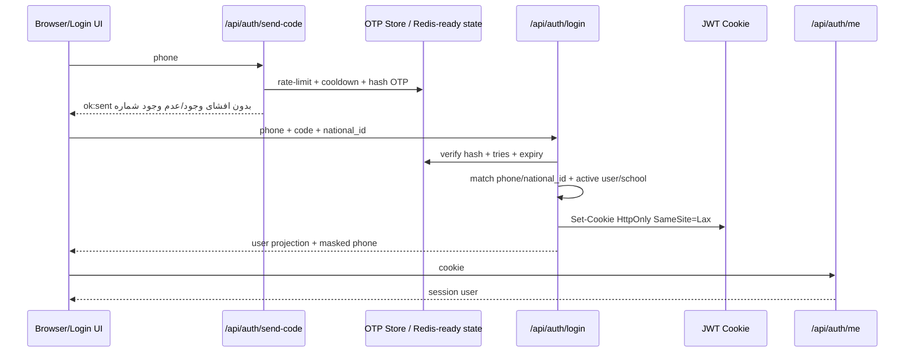
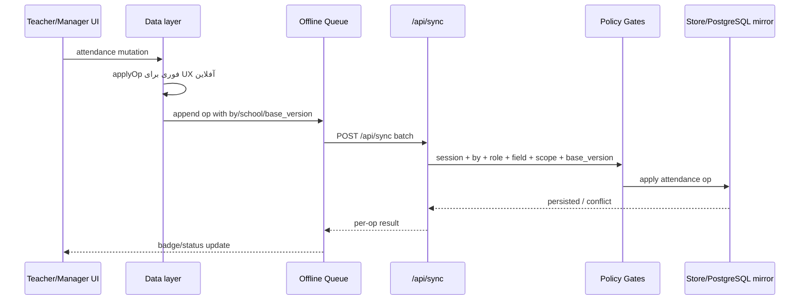
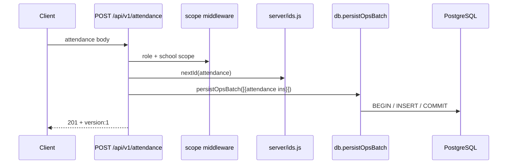
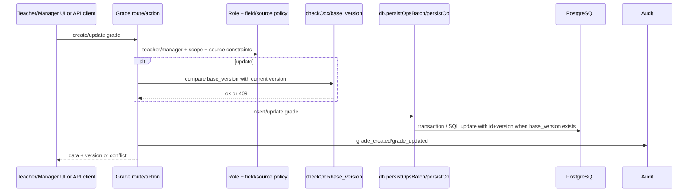
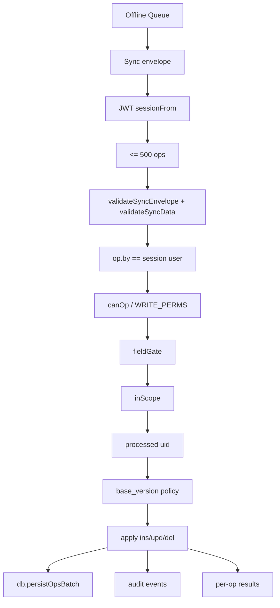
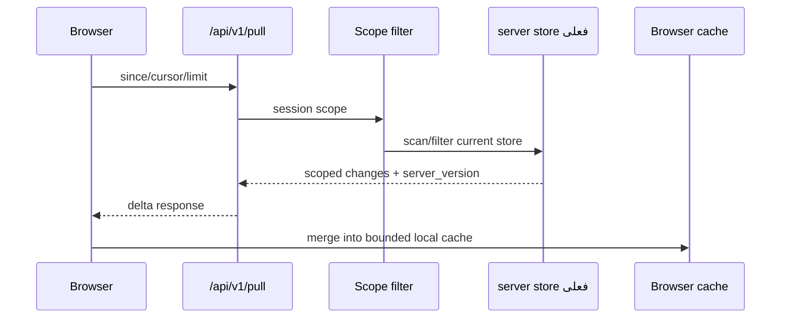

# Data Flow — Wave -1 / Architecture Discovery Part 1

**تاریخ:** ۱۸/۰۶/۱۴۰۵ — 2026-09-09  
**محدوده:** مسیرهای اصلی داده در معماری فعلی؛ بدون تغییر کد.  
**شاخه کاری Arena:** `arena/01a085da-p2`

---

## 1. نمای کلی Data Flow

```mermaid
flowchart TD
  User[کاربر در Browser] --> UI[UI / Views]
  UI --> Actions[data-act handlers]
  Actions --> Data[Data.add/update/remove]
  Data --> Apply[applyOp / event log]
  Apply --> Local[(localStorage/IndexedDB cache)]
  Apply --> Queue[Offline Sync Queue]
  Queue --> SyncClient[src/js/27-sync.js]
  SyncClient --> API[/api/sync]
  API --> Auth[sessionFrom JWT cookie]
  API --> Validate[validate + envelope checks]
  API --> Authz[WRITE_PERMS + fieldGate]
  API --> Scope[inScope / tenant checks]
  API --> Store[(server store)]
  API --> DB[server/db.js]
  DB --> PG[(PostgreSQL when active)]
  API --> Audit[audit.log]
  API --> Response[results + serverTime]
  Response --> SyncClient
  SyncClient --> UI
```

معماری فعلی آفلاین‌اول است: تغییرات در UI ابتدا در local state دیده می‌شوند، سپس در queue می‌نشینند و در زمان اتصال به سرور sync می‌شوند. در حالت سروری، REST API نیز برای منابع اصلی وجود دارد.

---

## 2. Flow ورود کاربر



### نکات امنیتی ورود

- محصول رمز عبور ندارد؛ ورود با موبایل + OTP + کد ملی است.
- OTP فقط hash می‌شود؛ echo کد فقط با `PAYESH_DEMO_CODE=1` برای دمو/تست است.
- نشست در cookie `HttpOnly` است، نه `localStorage`.
- پاسخ ارسال کد نباید امکان enumeration شماره‌ها را بدهد.
- rate-limit و revocation باید در production توزیع‌شده باشند.

---

## 3. Flow ثبت حضور

### مسیر کلاینت آفلاین/Sync



### مسیر REST سروری



به‌روزرسانی حضور با `base_version` از OCC عبور می‌کند و در صورت stale شدن باید `409 Conflict` بدهد.

---

## 4. Flow ثبت نمره



نکته مهم: تفکیک نمره داخلی/نهایی کشوری در لایه کلاینت و قواعد ورود ثبت شده است. سمت سرور باید در Waveهای بعدی با invariantهای قوی‌تر هم‌راستا شود.

---

## 5. Flow همگام‌سازی Push



### سیاست conflict فعلی

| مجموعه | سیاست |
|---|---|
| `grades`, `attendance`, `discipline` | conflict حفظ می‌شود و در `sync_conflicts` برای داوری مدیر ثبت می‌شود. |
| ساختاری‌ها مثل `users/classes/subjects/schedule` | stale base با `stale_base` رد می‌شود. |
| اعلان/پیام/یادداشت | آخرین نوشتن برنده، بر پایه زمان سرور. |

---

## 6. Flow Pull / Delta



محدودیت مهم: مسیر pull فعلی هنوز باید در Waveهای بعدی DB-native شود:

```sql
WHERE updated_at > $since
  AND scope_condition
ORDER BY updated_at, id
LIMIT $limit
```

---

## 7. مسیرهای ذخیره‌سازی فعلی

| لایه | وضعیت فعلی | هدف ملی |
|---|---|---|
| Browser | localStorage/IndexedDB + event log + queue | bounded cache + offline queue، نه دیتاست ملی |
| Server store | JSON/memory برای demo/dev و transitional server | در production نباید source of truth باشد |
| PostgreSQL | پشتیبانی در `server/db.js` و migrationها | تنها source of truth در production |
| Redis | cache/rate-limit/revocation/coordination آماده | state گذرا/توزیع‌شده، production readiness وابسته به Redis |
| Audit | فایل audit sanitize شده | async/centralized در Waveهای آینده |

---

## 8. Bottleneckهای Data Flow که برای Waveهای بعدی مهم‌اند

| Bottleneck | مسیر | Wave هدف |
|---|---|---|
| scan/filter/sort در JS برای readهای REST/Pull | `/api/v1/*`, `/api/v1/pull` | Wave 3 و Wave 4 |
| JSON store به‌عنوان مسیر transitional | `server/index.js`, `server/db.js` | Wave 1 |
| sync batch بزرگ و policy پیچیده | `/api/sync` | Wave 4 و Wave 5 |
| audit و backup در process برنامه | `server/audit.js`, `server/admin.js` | Wave 8/9/16 |
| cache بدون benchmark نهایی workload | `server/cache.js` | Wave 11 |

---

## 9. Evidence

- `src/js/00-data-layer.js` مرز Store/API و detectServer است.
- `src/js/03-persistence.js` و `src/js/27-sync.js` مسیر apply/queue/sync را نگه می‌دارند.
- `server/auth.js` ورود و session را اجرا می‌کند.
- `server/sync.js` push sync، validation، authz، scope، conflict و mirror را اجرا می‌کند.
- `server/pull.js` مسیر pull فعلی را دارد.
- `server/routes/attendance.js` و `server/routes/grades.js` مسیرهای REST حضور/نمره را اجرا می‌کنند.
- `server/db.js` transaction و bridge به PostgreSQL را فراهم می‌کند.
