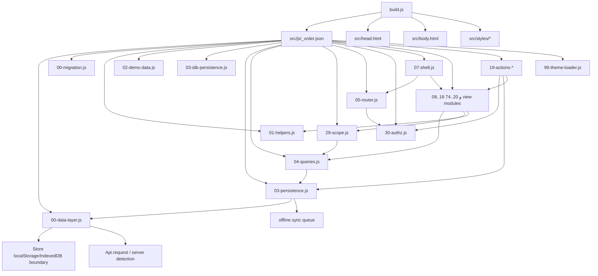
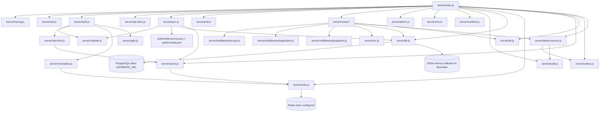
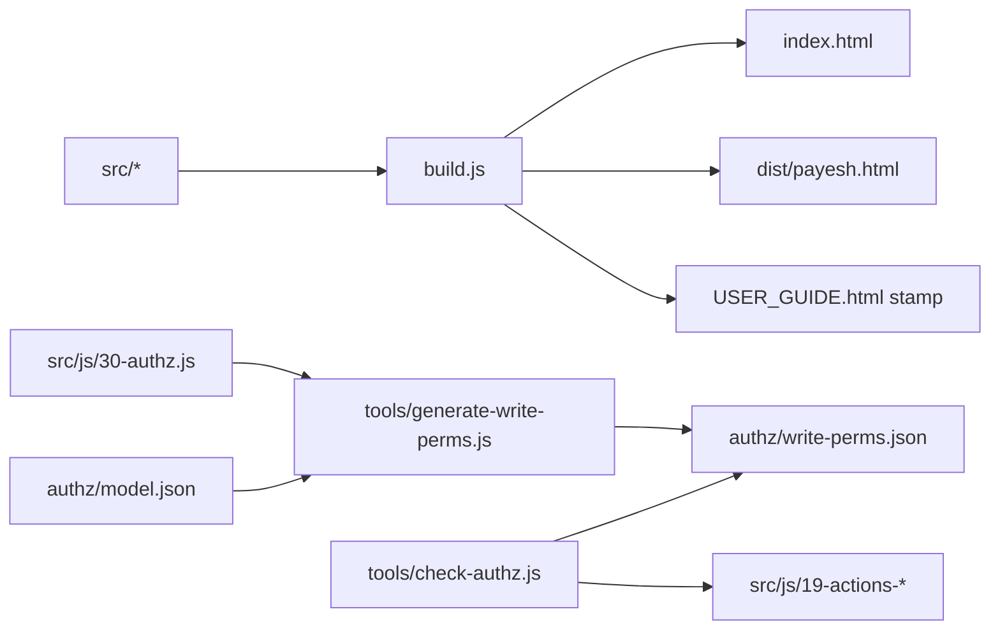

# Dependency Graph — Wave -1 / Architecture Discovery Part 1

**تاریخ:** ۱۸/۰۶/۱۴۰۵ — 2026-09-09  
**محدوده:** مستندسازی وابستگی‌های اصلی معماری فعلی؛ بدون تغییر کد.  
**شاخه کاری Arena:** `arena/01a085da-p2`

---

## 1. خلاصه یک‌خطی

پایش یک **Modular Monolith** با دو نیمه است: کلاینت تک‌فایلی آفلاین‌اول که از `src/js/_order.json` ساخته می‌شود، و سرور Node.js که API/Auth/Sync/REST/Cache/DB را در یک فرایند stateless-lean اجرا می‌کند. وابستگی اصلی معماری، عبور همه تغییرات داده از لایه‌های مرکزی است: در کلاینت `Data`/`applyOp` و در سرور `auth → scope/authz/validate → routes/sync → db/cache/audit`.

---

## 2. Dependency Graph کلاینت

ترتیب بارگذاری کلاینت در `src/js/_order.json` قفل شده است. وابستگی‌ها به‌صورت global-function/module-script هستند، نه import/export مدرن؛ بنابراین ترتیب بارگذاری خودش بخشی از قرارداد معماری است.

### نقاط حساس کلاینت

| ناحیه | فایل/فایل‌ها | نقش معماری | قانون |
|---|---|---|---|
| ساخت تک‌فایلی | `build.js` | ادغام HTML/CSS/JS و CSP nonce placeholder | `index.html` دستی ویرایش نشود. |
| مرز داده | `src/js/00-data-layer.js` | تنها دروازه Store/API | خارج از قرارداد، `localStorage`/`fetch` مستقیم اضافه نشود. |
| event log | `src/js/03-persistence.js` | `Data.add/update/remove` و queue آفلاین | همه نوشتن‌ها از `applyOp` عبور کنند. |
| sync client | `src/js/27-sync.js`, `src/js/29-pull.js` | push/pull و dead-letter/conflict client state | queue محدود و قابل بازیابی بماند. |
| authorization UI | `src/js/30-authz.js` | `canRoute` و `canAction` | فقط UX است؛ امنیت واقعی سمت سرور است. |
| scope client | `src/js/29-scope.js`, `src/js/04-queries.js` | محدودسازی دید در UI | نباید جایگزین scope سمت سرور شود. |
| router/shell | `src/js/05-router.js`, `src/js/07-shell.js` | ناوبری، رندر و role home | route جدید باید عنوان، view و مجوز داشته باشد. |
| actions | `src/js/19-actions-*` | event delegation با `data-act` | action نویسنده باید در authz/check-authz پوشش داشته باشد. |

---

## 3. Dependency Graph سرور

سرور یک برنامه Node.js ماژولار است که از `server/index.js` بوت می‌شود. `index.js` ترکیب‌کننده است؛ منطق دامنه در route/serviceهاست.

### نقاط حساس سرور

| ناحیه | فایل/فایل‌ها | نقش معماری | قانون |
|---|---|---|---|
| router مرکزی | `server/index.js` | route dispatch، security headers، health، static | middlewareهای امنیتی قبل از API حساس اعمال شوند. |
| auth/session | `server/auth.js` | OTP، JWT، cookie، `/api/auth/*` | نقش از token خوانده شود؛ بدنه درخواست معتبر نیست. |
| OTP/rate/revocation | `otp-store.js`, `rate-limit.js`, `revocation.js`, `redis.js` | state گذرا | در production باید Redis-ready باشد. |
| sync push | `server/sync.js` | validation/authz/scope/OCC/idempotency | fail-closed و batch محدود. |
| pull delta | `server/pull.js` | pull scope شده | در Waveهای بعدی باید DB-native شود. |
| REST منابع | `server/routes/*.js` | bootstrap/students/classes/attendance/grades/users | policy با sync نباید واگرا شود. |
| DB abstraction | `server/db.js` | query/transaction/persistOp/persistOpsBatch | Production target: PostgreSQL source of truth. |
| IDs | `server/ids.js` | identity/sequence یا fallback dev | در PG از identity/sequence؛ نه `max(id)+1`. |
| audit | `server/audit.js` | log sanitize شده و append-only | PII کامل/secret وارد log نشود. |
| soft delete/outbox | `delete-service.js`, `outbox.js` | tombstone و event | side effectها باید async/worker-ready شوند. |

---

## 4. Build و مستندات وابستگی

قفل مهم: `node build.js --check` علاوه بر build، همگامی راهنما، تولید مجوزها و `check-authz` را نیز کنترل می‌کند.

---

## 5. Dependency Risk Map

| ریسک | ناحیه | شدت | توضیح |
|---|---|---|---|
| Global order coupling | کلاینت `src/js/_order.json` | High | چون ماژول‌ها import/export ندارند، جابه‌جایی ترتیب می‌تواند runtime را بشکند. |
| Dual data path | REST و Sync | Critical | اگر policy یا persistence جدا رشد کند، tenant isolation و consistency آسیب می‌بیند. |
| JSON fallback در production | `server/db.js`, `server/index.js` | Critical | طبق roadmap، production باید PostgreSQL-only شود. |
| Scope duplication | کلاینت/سرور | High | scope کلاینت UX است؛ scope سرور باید منبع امنیت باشد. |
| Whole-store flows | Pull/REST فعلی | High | بسیاری از readها هنوز store را filter/sort/slice می‌کنند؛ Wave 3 باید DB-native کند. |
| Runtime generated schema | `tools/migrate-to-pg.js`, `server/schema.sql`, `migrations/` | Medium | باید schema/migration drift با تست قفل شود. |

---

## 6. Evidence

- `src/js/_order.json` ترتیب کلاینت را تعریف می‌کند.
- `build.js` خروجی تک‌فایلی و gateهای build/check-authz را اجرا می‌کند.
- `server/index.js` routeهای `/api/auth/*`, `/api/sync`, `/api/v1/*` را dispatch می‌کند.
- `server/auth.js` مالک OTP/JWT/session است.
- `server/sync.js` مالک sync push و `authz/write-perms.json` است.
- `server/routes/*` مالک REST resource APIs است.
- `server/db.js` مالک transaction و persistence bridge است.
