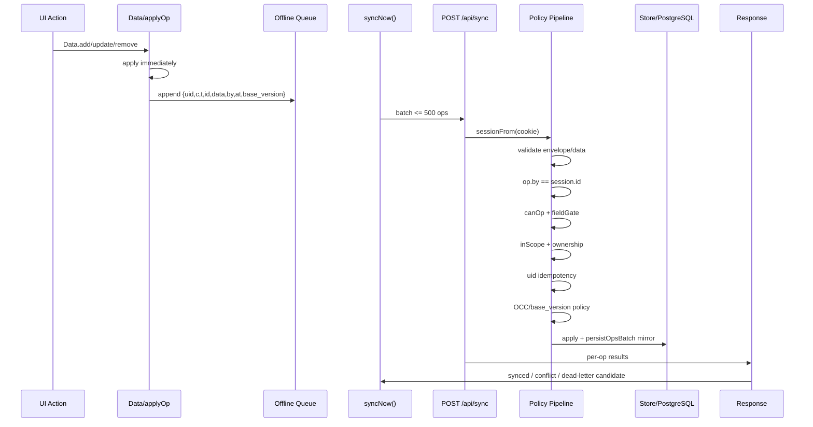
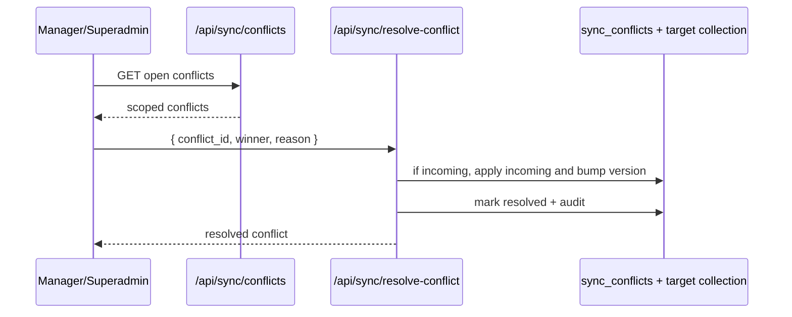
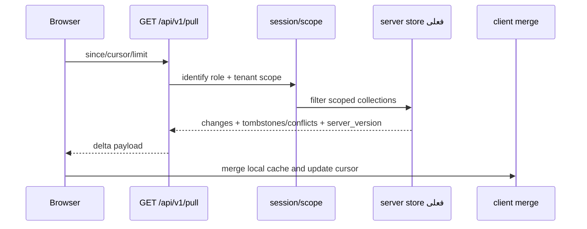

# Sync Flow — Wave -1 / Architecture Discovery Part 1

**تاریخ:** ۱۸/۰۶/۱۴۰۵ — 2026-09-09  
**محدوده:** مستندسازی مسیر همگام‌سازی آفلاین/سرور؛ بدون تغییر کد.  
**شاخه کاری Arena:** `arena/01a085da-p2`

---

## 1. خلاصه

Sync در پایش برای حفظ Offline-first طراحی شده است: کاربر در مرورگر کار می‌کند، تغییرات در event log/queue محلی ذخیره می‌شوند، سپس در حالت سروری به `/api/sync` push می‌شوند و از `/api/v1/pull` delta می‌گیرند. سرور برای داده‌های حساس `base_version`/OCC و برای conflictهای مهم، حفظ conflict و داوری مدیر دارد.

---

## 2. اجزای Sync

| جزء | فایل | نقش |
|---|---|---|
| Data boundary | `src/js/00-data-layer.js` | تشخیص server/local و `Api.request` |
| Local persistence | `src/js/03-persistence.js` | apply operation، event log، queue آفلاین |
| Push client | `src/js/27-sync.js` | `syncNow`, badge, panel, retry/dead-letter behavior |
| Pull client | `src/js/29-pull.js` | دریافت delta از سرور و merge محلی |
| Push server | `server/sync.js` | validation، authz، scope، idempotency، OCC، conflict |
| Pull server | `server/pull.js` | pull scope شده و server_version |
| Conflict API | `server/conflicts.js` | فهرست/داوری conflict توسط manager/superadmin |
| DB mirror | `server/db.js` | `persistOpsBatch` و PostgreSQL mirror |
| Idempotency | `server/db.js`, `server/cache.js` | UID processed tracking |

---

## 3. Push Flow



---

## 4. Server Push Pipeline

```mermaid
flowchart TD
  Start[/api/sync] --> Session[sessionFrom]
  Session --> Envelope[validateSyncEnvelope]
  Envelope --> Size[batch <= 500]
  Size --> ForEach[for each op]
  ForEach --> Shape[validateSyncData]
  Shape --> By[op.by == session id]
  By --> Time[clock drift audit]
  Time --> UID[processed uid?]
  UID --> Role[canOp from authz/write-perms]
  Role --> Field[fieldGate]
  Field --> Scope[inScope]
  Scope --> OCC[base_version check]
  OCC -->|versioned stale| Preserve[store sync_conflicts + notify manager]
  OCC -->|structural stale| Reject[stale_base]
  OCC -->|ok/LWW| Apply[apply ins/upd/del]
  Apply --> Mirror[db.persistOpsBatch]
  Mirror --> Mark[processed uid]
  Mark --> Result[results[]]
```

### قاعده Fail-Closed

- collection ناشناخته → reject
- field ناشناخته → reject
- نقش نامجاز → reject
- out-of-scope → reject/404-style behavior در endpointهای IDدار
- `op.by` جعلی → کل batch آلوده و رد
- `base_version` بدشکل → validation failed

---

## 5. Conflict Model

| نوع داده | سیاست فعلی | دلیل |
|---|---|---|
| `grades` | conflict حفظ شود | نمره حساس است و بازنویسی کور خطرناک است. |
| `attendance` | conflict حفظ شود | حضور/غیاب سند عملیاتی مدرسه است. |
| `discipline` | conflict حفظ شود | داده انضباطی حساس و نیازمند داوری است. |
| ساختار مدرسه/کاربران/کلاس/درس/برنامه | سرور مرجع؛ stale رد می‌شود | ساختار نباید با کلاینت کهنه overwrite شود. |
| اعلان/پیام/یادداشت | LWW بر پایه زمان سرور | حساسیت consistency کمتر از داده آموزشی رسمی است. |

### داوری conflict



---

## 6. Pull Flow



### محدودیت فعلی Pull

Pull فعلی برای National Scale باید در Wave 4 DB-native شود. هدف Addendum/Roadmap:

```sql
WHERE updated_at > $since
  AND scope_condition
ORDER BY updated_at, id
LIMIT $limit
```

و cursor باید در برابر timestamp برابر، boundary pagination و clock skew مقاوم باشد.

---

## 7. Queue و Dead Letter

وضعیت هدف برای queue طبق roadmap:

| ویژگی | وضعیت هدف |
|---|---|
| max operations | bounded |
| max bytes | bounded |
| max age | bounded |
| retry limit | جلوگیری از retry بی‌نهایت |
| dead-letter/conflict state | عملیات‌های پایداراً ناموفق از صف عادی خارج شوند |
| idempotency key | `uid` و در آینده `principal + operation + idempotency_key` |

---

## 8. Sync Security Boundaries

| boundary | کنترل |
|---|---|
| Browser → Server | همه payloadها untrusted هستند. |
| `op.by` | باید با `jwt.sub` بخواند. |
| `school_id` | برای نقش‌های scoped باید با session/tenant scope بخواند. |
| Field policy | `fieldGate` و `authz/model.json`/`write-perms.json`. |
| IDOR/BOLA | resource id به‌تنهایی authorization نیست. |
| Replay | uid/idempotency. |
| Concurrent write | base_version/OCC. |

---

## 9. ریسک‌ها و Waveهای هدف

| ریسک | شدت | Wave هدف |
|---|---|---|
| Pull با scan/filter در store | High | Wave 4 |
| Sync و REST policy drift | Critical | Wave 5 |
| JSON/memory source of truth | Critical | Wave 1 |
| state توزیع‌نشده برای idempotency/OTP/rate | High | Wave 6 |
| conflict زیاد بدون UX/ops مناسب | Medium | Wave 4/17 |
| نبود load/soak برای queue | High | Wave 18 |

---

## 10. Evidence

- `src/js/27-sync.js`: `syncNow`, sync UI, queue behavior.
- `src/js/29-pull.js`: pull client.
- `server/sync.js`: push server pipeline.
- `server/pull.js`: pull route.
- `server/conflicts.js`: conflict listing/resolution.
- `server/db.js`: `persistOpsBatch`, uid tracking.
- `authz/write-perms.json`: server-side write permissions generated from model/actions.
