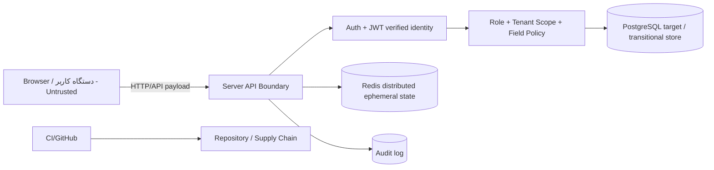

# Threat Model — Wave -1 / Architecture Discovery Part 2

**تاریخ:** ۱۸/۰۶/۱۴۰۵ — 2026-09-09  
**چارچوب:** STRIDE  
**محدوده:** مدل تهدید معماری فعلی پایش بر اساس `DEPENDENCY_GRAPH.md`، `DATA_FLOW.md`، `AUTH_FLOW.md` و `SYNC_FLOW.md`؛ بدون تغییر کد.  
**شاخه کاری Arena:** `arena/01a085da-p2`

---

## 1. خلاصه اجرایی

پایش در وضعیت فعلی چند لایه دفاعی مهم دارد: ورود بدون رمز با OTP/JWT، `HttpOnly` cookie، کنترل نقش و فیلد در sync، scope server-side، audit sanitize شده، secret scan، CSP nonce و تست‌های گسترده. با این حال برای مقیاس ملی، ریسک‌های اصلی همچنان حول این محورهای Critical هستند:

1. **چند Source of Truth** تا قبل از Wave 1: JSON/memory store در کنار PostgreSQL transitional path.
2. **واگرایی policy بین REST و Sync** تا قبل از Wave 5.
3. **state گذرای غیرکاملاً Redis-only در production** تا قبل از Wave 6.
4. **full scan/filter در مسیرهای read** تا قبل از Wave 3/4.
5. **نبود آزمون بار/soak/chaos ملی** تا قبل از Wave 18/19.

این سند تهدیدها را با STRIDE دسته‌بندی و برای هر کدام احتمال، اثر، سطح ریسک و mitigation اولیه را ثبت می‌کند.

---

## 2. دارایی‌ها و مرزهای اعتماد

### دارایی‌های اصلی

| دارایی | حساسیت | توضیح |
|---|---|---|
| داده دانش‌آموزان و اولیا | Critical | نام، کد ملی، شماره تماس، نمره، حضور، انضباط، شهریه |
| داده مدرسه/کلاس/برنامه | High | ساختار آموزشی و محدوده tenant |
| داده احراز هویت | Critical | OTP hash، JWT secret، session revocation، rate-limit state |
| sync queue و conflict data | High | داده آفلاین و نسخه‌های در تعارض |
| audit log | High | شواهد امنیتی و عملیاتی؛ نباید PII کامل/secret داشته باشد |
| schema/migrations | High | invariantهای دیتابیس و مسیر recovery |
| مستندات معماری و runbook | Medium/High | مبنای تصمیم و عملیات production |

### مرزهای اعتماد



اصل: هر چیزی که از Browser، فایل import، queue آفلاین یا API body می‌آید **untrusted** است.

---

## 3. STRIDE Threat Register

راهنما:

- احتمال: Low / Medium / High
- اثر: Low / Medium / High / Critical
- سطح ریسک: ترکیب احتمال و اثر

| ID | STRIDE | تهدید | سناریو | احتمال | اثر | ریسک | کنترل موجود | راهکار اولیه / Wave هدف |
|---|---|---|---|---|---|---|---|---|
| T01 | Spoofing | جعل نقش در payload | مهاجم در sync یا REST بدنه درخواست را با `role=manager` یا `by` جعلی می‌فرستد. | Medium | Critical | Critical | `op.by == session`, JWT role, fieldGate | حفظ fail-closed؛ یکپارچه‌سازی policy REST/Sync در Wave 5 |
| T02 | Spoofing | سرقت/Replay نشست | token یا cookie از دستگاه آلوده یا کانال ناامن سوءاستفاده شود. | Medium | Critical | Critical | HttpOnly cookie، exp، jti، revocation | Secure فقط زیر HTTPS production؛ Redis revocation در Wave 6؛ device/session monitoring در Wave 13 |
| T03 | Spoofing | OTP brute force یا enumeration شماره | مهاجم شماره‌های معتبر یا کد OTP را حدس بزند. | Medium | High | High | hash-only OTP، cooldown، IP/phone limits، پاسخ هم‌شکل send-code | Redis-only rate-limit/OTP در Wave 6؛ abuse metrics/alerts در Wave 14 |
| T04 | Tampering | دستکاری queue آفلاین | کاربر localStorage/IndexedDB را ویرایش و عملیات غیرمجاز می‌سازد. | High | High | Critical | sync validation/authz/scope/fieldGate | ادامه treat-as-untrusted؛ contract tests گسترده Wave 5/17 |
| T05 | Tampering | بازنویسی کور نمره/حضور | دو کاربر هم‌زمان یک رکورد حساس را تغییر دهند و تغییر درست پاک شود. | Medium | High | High | `base_version`, conflict preservation, SQL OCC در Wave 2 | DB-native OCC end-to-end پس از Wave 1/4؛ تست concurrency در Wave 17 |
| T06 | Tampering | دو Source of Truth | JSON/memory و PostgreSQL diverge شوند و پاسخ instanceها متفاوت شود. | High تا قبل Wave 1 | Critical | Critical | مستند و بخشی از DB bridge | Wave 1: PostgreSQL تنها source of truth؛ حذف production JSON persistence |
| T07 | Repudiation | انکار عملیات حساس | کاربر تغییر نمره/حضور/حذف را انکار کند. | Medium | High | High | audit sanitize شده، by/user_id | audit مرکزی immutable و trace correlation در Wave 14/16 |
| T08 | Repudiation | دستکاری/حذف audit | attacker یا خرابی disk audit را از بین ببرد. | Medium | High | High | audit خارج store، append-style، rotation | centralized logging + WORM/off-site retention در Wave 14/16 |
| T09 | Information Disclosure | IDOR/BOLA بین مدارس | manager/teacher/parent با ID معتبر به داده tenant دیگر برسد. | Medium | Critical | Critical | scope server-side، 404 برای out-of-scope، projection | اثبات tenant isolation با ماتریس REST/Sync در Wave 5 و تست امنیت Wave 13 |
| T10 | Information Disclosure | افشای PII در response/log | کد ملی/تلفن کامل در response غیرمجاز یا audit چاپ شود. | Medium | Critical | Critical | projection، audit sanitize، secret scan | DLP/log tests، field-level response policy در Wave 13/17 |
| T11 | Information Disclosure | XSS و خواندن داده local cache | ورودی مخرب در HTML اجرا شود و داده cache را بخواند. | Medium | High | High | `esc/escAttr`, CSP nonce، xss guards | CSP/reporting، security regression و DAST در Wave 13 |
| T12 | Information Disclosure | نشت secret در repo یا chat | token/JWT key/PEM وارد فایل یا log شود. | Medium | Critical | Critical | `.gitignore`, `secret-scan.js` | secret scanning CI اجباری، rotation policy و SBOM در Wave 13 |
| T13 | Denial of Service | فشار روی login/OTP | botnet endpointهای OTP/login را می‌زند. | High | High | Critical | rate-limit و cooldown | Redis atomic limits، WAF/DDoS strategy و alerts در Wave 6/12/14 |
| T14 | Denial of Service | full scan readها | endpointهای پرترافیک همه store را load/filter/sort کنند. | High | High | Critical | pagination array محدود ولی بعد از filter | DB-native WHERE/ORDER/LIMIT و indexes در Wave 3/4 |
| T15 | Denial of Service | sync batch/queue growth | queue بزرگ، retry بی‌نهایت یا conflict زیاد باعث فشار CPU/RAM شود. | Medium | High | High | batch limit 500، DLQ concepts | bounded queue، retry limits، soak tests در Wave 7/18 |
| T16 | Denial of Service | synchronous disk I/O | JSON stringify/write، backup یا audit sync در request path latency را بالا ببرد. | Medium | High | High | برخی interval/persist controls | خارج کردن I/O سنگین از request path و workers در Wave 8/9 |
| T17 | Elevation of Privilege | self-update غیرمجاز | کاربر fieldهایی مثل role/status/school_id را تغییر دهد. | Medium | Critical | Critical | fieldGate، protected fields، no role escalation | policy واحد REST/Sync و self-update allowlist در Wave 5 |
| T18 | Elevation of Privilege | authorization موازی | REST و Sync قوانین متفاوت داشته باشند و یکی bypass شود. | Medium | Critical | Critical | بخشی مرکزی در authz/write-perms برای sync | authorization service/policy layer واحد در Wave 5 |
| T19 | Elevation of Privilege | cache poisoning/stale authz | cache داده یا مجوز stale/اشتباه به tenant دیگر بدهد. | Low/Medium | Critical | High | cache invalidation tests فعلی | cache key با tenant/role، benchmark و invalidation strategy در Wave 11 |
| T20 | Tampering/DoS | migration کنترل‌نشده | schema بدون migration یا rollback تغییر کند و production data خراب شود. | Medium | Critical | Critical | migrations Wave 2، db-engineering tests | migration runner، forward-recovery، restore drill در Wave 2/16 |
| T21 | Information Disclosure | فایل import آلوده | CSV/Excel با formula injection یا PII cross-tenant وارد شود. | Medium | High | High | csv formula escaping و import validation | server-side import validation/rate-limit در Wave 13/17 |
| T22 | DoS/Repudiation | خرابی Redis/DB بدون readiness درست | instance unhealthy ترافیک بگیرد و عملیات گم یا کند شود. | Medium | Critical | Critical | health و cache readiness بخشی موجود | liveness/readiness دقیق، graceful shutdown، failover tests در Wave 15/19 |
| T23 | Spoofing/Tampering | CSRF روی endpointهای cookie-based | چون session cookie است، درخواست cross-site ممکن است عملیات بزند. | Medium | High | High | SameSite=Lax، JSON endpoints | CSRF threat review برای state-changing endpoints در Wave 13 |
| T24 | Tampering | فایل/attachment handling آینده | آپلود تکلیف/فایل کلاس مجازی می‌تواند malware/PII leak ایجاد کند. | Low/Medium | High | Medium/High | object storage هنوز قفل عملیاتی نشده | content-type/size/AV/object ACL در Wave 12/13 |

---

## 4. سناریوهای سوءاستفاده مهم

### 4.1 IDOR/BOLA بین مدارس

```text
attacker = manager مدرسه A
هدف = student_id از مدرسه B
مسیر = GET/PATCH/Sync op با resource id معتبر
کنترل لازم = role + tenant scope + resource ownership + 404 برای out-of-scope
```

ریسک ملی: Critical، چون IDهای عددی قابل حدس هستند و طبق تصمیم معماری فقط با scope/enum-guard امن می‌مانند.

### 4.2 Queue آفلاین دستکاری‌شده

```text
کاربر localStorage را تغییر می‌دهد → op جعلی با school_id/role/status/phone/national_id می‌سازد → sync
```

کنترل لازم: server-side validation/fieldGate/scope و رد fail-closed. هیچ اعتماد امنیتی به کلاینت مجاز نیست.

### 4.3 Divergence چند instance

```text
API A به JSON/memory می‌نویسد
API B از state دیگر می‌خواند
کاربر پاسخ متفاوت می‌گیرد
```

کنترل لازم: Wave 1، PostgreSQL source of truth و Redis برای ephemeral state.

### 4.4 DoS با readهای پرترافیک

```text
GET /api/v1/students?search=...
GET /api/v1/attendance?date=...
GET /api/v1/pull
```

اگر مسیر full scan/filter/sort بماند، در دیتاست ملی CPU و latency شدیداً رشد می‌کند.

---

## 5. Mitigation Roadmap

| Wave | نقش در کاهش تهدید |
|---|---|
| Wave -1 | کشف معماری، threat model، bottleneck map |
| Wave 1 | حذف دو source of truth؛ PostgreSQL-only production |
| Wave 3 | حذف full scan readها؛ SQL pagination/index |
| Wave 4 | DB-native sync/pull، tombstone و cursor مقاوم |
| Wave 5 | authorization/tenant isolation واحد برای REST و Sync |
| Wave 6 | Redis-only distributed critical state |
| Wave 13 | ASVS، SAST/DAST/SCA، security tests، abuse protection |
| Wave 14 | metrics/logs/traces/alerts برای detection |
| Wave 16 | DR، backup، PITR، restore/failover drill |
| Wave 18/19 | load/soak/chaos/recovery اثبات‌شده |

---

## 6. اولویت‌های فوری پیشنهادی

1. **Wave 1 را قبل از هر افزایش ظرفیت جدی کامل کنید:** production نباید JSON/memory source of truth داشته باشد.
2. **Wave 5 را زودتر از توسعه featureهای جدید سنگین انجام دهید:** REST و Sync باید policy واحد داشته باشند.
3. **Wave 3/4 را با benchmark واقعی ببندید:** هر endpoint پرترافیک باید DB-native شود.
4. **Wave 6 را با readiness سخت اجرا کنید:** Redis down در production باید not-ready باشد، نه fallback محلی.
5. **Wave 13/17 را به CI وصل کنید:** threatهای بالا باید تست regression/security داشته باشند.

---

## 7. Evidence

- `docs/DEPENDENCY_GRAPH.md`
- `docs/DATA_FLOW.md`
- `docs/AUTH_FLOW.md`
- `docs/SYNC_FLOW.md`
- `docs/SERVER_SECURITY_CONTRACT.md`
- `server/auth.js`
- `server/sync.js`
- `server/routes/*`
- `server/db.js`
- `server/redis.js`
- `server/cache.js`
